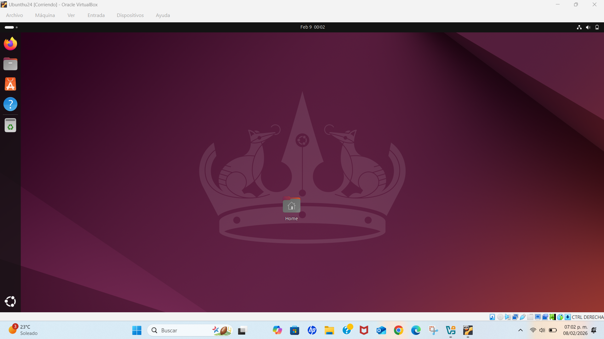
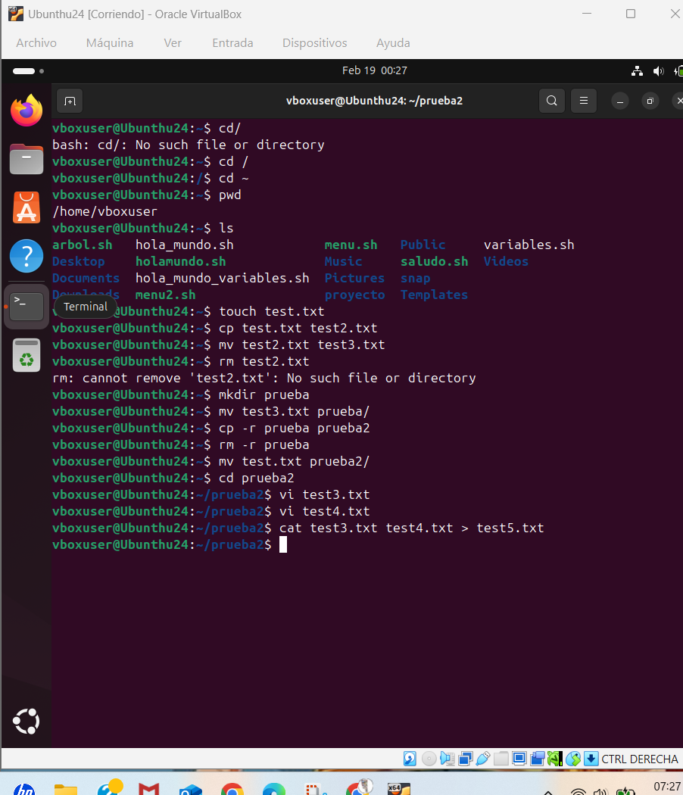
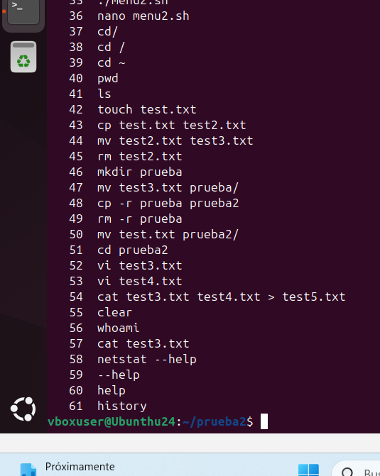

# Portafolio de Tareas.

## Tarea -998

Instalar Virtualbox y Ubunthu

## Tarea -997 

Adventures niveles gratuitos.

## Tarea -996

Practica de comandos.

## Tarea -995

Menu en Bash.
[Tarea 995 - Ver video](https://asciinema.org/a/sxZVAffs8qCyALnD)

### **Codigo del Menu.**
#!/bin/bash

opcion=""

while true
do

banner MENU
echo "1.-\033[40m\033[1;33m Crear árbol de directorios \033[0m"

echo "2.-\033[40m\033[1;33m  Hola Mundo \033[0m"

echo "3.-\033[40m\033[1;33m  Saludo \033[0m"

echo "x.-\033[40m\033[1;33m  Salir\n\n"

echo -n "Elige una opcion:"
read OPCION

case ${OPCION} in

1) ./arbol.sh; read -p "Presiona enter para continuar";;

2) ./holamundo.sh; read -p "Presiona enter para continuar";;

3) ./saludo.sh; read -p "Presiona enter para continuar";;

x) break;;

esac

done

## Tarea -993

Scrips de Bash (18).
[[Tarea 993 - Ver video](https://asciinema.org/a/z7cK4pFiNkhNWLCe)]

