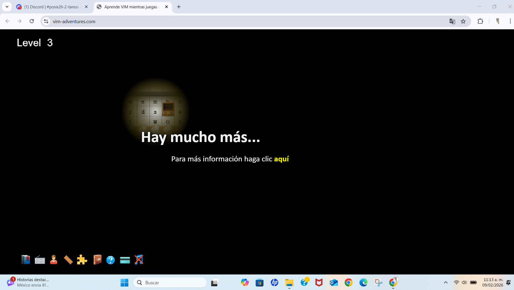
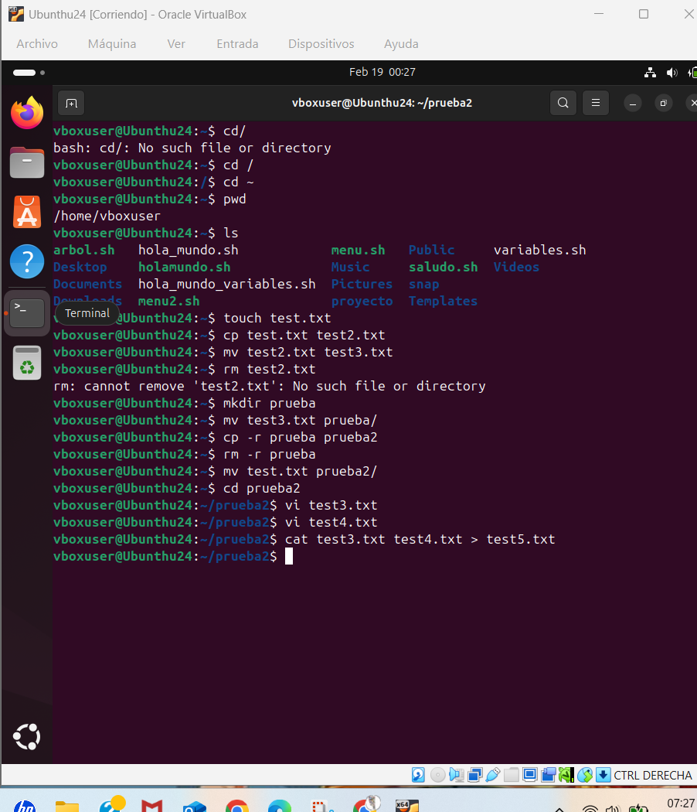
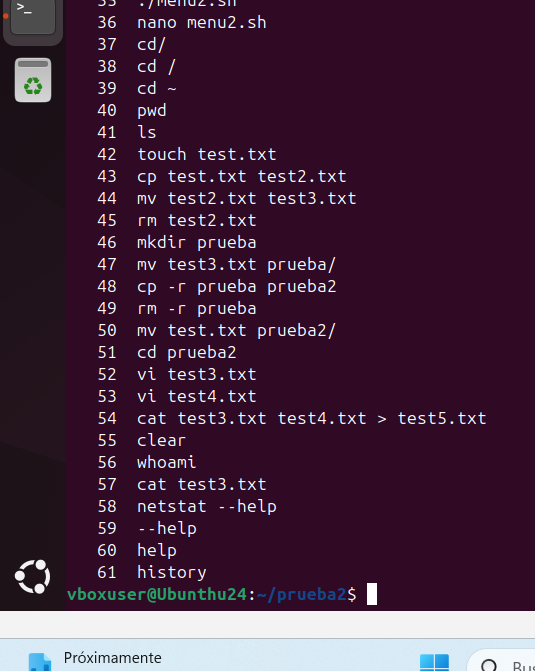
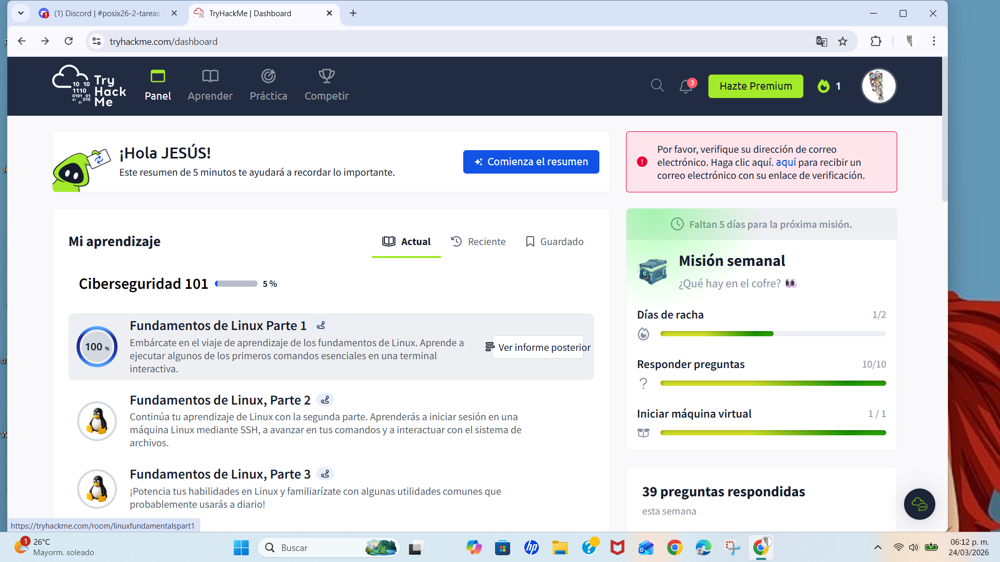
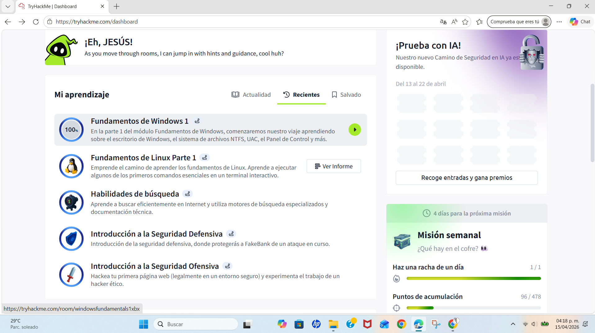

# Portafolio de Tareas.


# 1er Parcial
## Tarea -998

Instalar Virtualbox y Ubunthu


## Tarea -997 

Adventures niveles gratuitos.



## Tarea -996

Practica de comandos.




## Tarea -995

Menu en Bash.
[Tarea 995 - Ver video](https://asciinema.org/a/sxZVAffs8qCyALnD)


### **Codigo del Menu.**
#!/bin/bash

opcion=""

while true
do

banner MENU
echo "1.-\033[40m\033[1;33m Crear árbol de directorios \033[0m"

echo "2.-\033[40m\033[1;33m  Hola Mundo \033[0m"

echo "3.-\033[40m\033[1;33m  Saludo \033[0m"

echo "x.-\033[40m\033[1;33m  Salir\n\n"

echo -n "Elige una opcion:"
read OPCION

case ${OPCION} in

1) ./arbol.sh; read -p "Presiona enter para continuar";;

2) ./holamundo.sh; read -p "Presiona enter para continuar";;

3) ./saludo.sh; read -p "Presiona enter para continuar";;

x) break;;

esac

done


## Tarea -993

Scrips de Bash (18).
[[Tarea 993 - Ver video](https://asciinema.org/a/z7cK4pFiNkhNWLCe)]


## //////////////////////////////////////////////////////////////////////////////////////


# 2do Parcial

## Tarea -989
### Modulo TryHackMe Linux



## Tarea -988
### Modulo TryHackMe Windows



## Tarea -987
### Jail/Challenge
### Codigo Bash
```
#!/bin/bash


#Colores
RED='\033[0;31m'
GREEN='\033[0;32m'
YELLOW='\033[1;33m'
CYAN='\033[0;36m'
BOLD='\033[1m'
NC='\033[0m'

clear
echo -e "${RED}"
cat << 'EOF'
 ██╗      █████╗      ██████╗███████╗██╗     ██████╗  █████╗ 
 ██║     ██╔══██╗    ██╔════╝██╔════╝██║     ██╔══██╗██╔══██╗
 ██║     ███████║    ██║     █████╗  ██║     ██║  ██║███████║
 ██║     ██╔══██║    ██║     ██╔══╝  ██║     ██║  ██║██╔══██║
 ███████╗██║  ██║    ╚██████╗███████╗███████╗██████╔╝██║  ██║
 ╚══════╝╚═╝  ╚═╝     ╚═════╝╚══════╝╚══════╝╚═════╝ ╚═╝  ╚═╝
EOF
echo -e "${NC}"
echo -e "${YELLOW}  Sistema de Seguridad v2.0 — Acceso Restringido${NC}"
echo -e "${CYAN}  Estás atrapado. Encuentra la flag para salir.${NC}"
echo "3nc0d3D"


JAILDIR="/tmp/la_celda"
rm -rf "$JAILDIR"
mkdir -p "$JAILDIR/archivos"
mkdir -p "$JAILDIR/.oculto/.profundo"

#Archivos señuelo
echo "Nada útil aquí."                          > "$JAILDIR/archivos/memo.txt"
echo "Contraseña: no tan fácil ;)"              > "$JAILDIR/archivos/pista.txt"
echo "Error 404: Flag not found."               > "$JAILDIR/archivos/flag.txt"
echo "El sistema está vigilando cada movimiento." > "$JAILDIR/archivos/aviso.txt"

#Flag real
FLAG="CTF{3sc4p3_d3_l4_c3ld4_2024}"
echo "$FLAG" > "$JAILDIR/.oculto/.profundo/flag_real.txt"
chmod 600 "$JAILDIR/.oculto/.profundo/flag_real.txt"

#Pista codificada base64
echo "L29jdWx0by8ucHJvZnVuZG8v" > "$JAILDIR/archivos/encoded.txt"  # base64 de "/.oculto/.profundo/"

echo -e "${RED}┌─────────────────────────────────────────┐${NC}"
echo -e "${RED}│  SHELL RESTRINGIDO — Solo lectura        │${NC}"
echo -e "${RED}│  Comandos: ver <archivo>                 │${NC}"
echo -e "${RED}│  Directorio actual: /archivos            │${NC}"
echo -e "${RED}│  Para salir introduce la flag            │${NC}"
echo -e "${RED}└─────────────────────────────────────────┘${NC}"
echo ""


while true; do
    echo -ne "${CYAN}celda@jail${NC}:${YELLOW}/archivos${NC}$ "
    read -r INPUT
    # comando de salida
    if [[ "$INPUT" == flag:* ]]; then
        INTENTO="${INPUT#flag:}"
        INTENTO="${INTENTO// /}" 

        if [ "$INTENTO" = "$FLAG" ]; then
            echo ""
            echo -e "${GREEN}╔══════════════════════════════════════════╗${NC}"
            echo -e "${GREEN}║   ¡¡ ESCAPASTE DE LA CELDA !!           ║${NC}"
            echo -e "${GREEN}║   Flag correcta. Acceso concedido.      ║${NC}"
            echo -e "${GREEN}╚══════════════════════════════════════════╝${NC}"
            echo ""
            exit 0
        else
            echo -e "${RED}[-] Flag incorrecta. Sigues atrapado.${NC}"
            echo ""
            continue
        fi
    fi

 #Parsear comando "ver <archivo>"
    if [[ "$INPUT" == ver* ]]; then
        ARCHIVO="${INPUT#ver }"


        # VULNERABILIDAD INTENCIONAL
        # Permite inyectar comandos con ; | $() etc.
        echo -e "${YELLOW}[*] Mostrando: $ARCHIVO${NC}"
        echo "---"
        eval "cat $JAILDIR/archivos/$ARCHIVO 2>/dev/null" || echo -e "${RED}[-] Archivo no encontrado.${NC}"
        echo "---"
        echo ""
        continue
    fi

    #Comando help
    if [[ "$INPUT" == "help" ]]; then
        echo ""
        echo -e "  ${BOLD}Comandos disponibles:${NC}"
        echo -e "  ${CYAN}ver <archivo>${NC}   — Muestra el contenido de un archivo"
        echo -e "  ${CYAN}flag:<valor>${NC}    — Intenta escapar con la flag"
        echo -e "  ${CYAN}help${NC}            — Muestra esta ayuda"
        echo ""
        continue
    fi

    #Cualquier otro comando: bloqueado
    echo -e "${RED}[-] Comando no reconocido. Escribe 'help' para ver opciones.${NC}"
    echo ""

done
```
### Grabacion Asciinema
[[Tarea 987 - ver video](https://asciinema.org/a/ZRvvpWnJDNyK0qHe)] 

## Tarea -986
### Ejecucion de menu en bash 18scrips
[[Tarea 986 - Ver video](https://asciinema.org/a/yUaQfn7glowYZl3V)]

## Tarea -985
### Herramienta modulo OS python
### Codigo python
```
import os 
def mostrar_menu():
    print("\n====HERRAMINETA DE MODULO OS ====")
    print("1. Mostrar directorio actual")
    print("2. Listar archivos y carpetas")
    print("3. Crear una carpeta")
    print("4. Eliminar una carpeta")
    print("5. cambiar de directorio")
    print("x. Salir")

while True:
    mostrar_menu()
    opcion=input("Selecciona una opción: ")

    if opcion=="1":
        print("Directorio actual:", os.getcwd())

    elif opcion=="2":
        archivos=os.listdir()
        print("Contenido del directorio: ")
        for archivo in archivos:
            print("-", archivo)

    elif opcion=="3":
        nombre=input("¿Que nombre llevara la nueva carpeta?:")
        os.mkdir(nombre)
        try:
            print("Carpeta creada correctamnete!")
        except:
            print("La carpeta no se pudo crear.")

    elif opcion=="4":
        nombre=input("nombre de la carpetra que se quiere borrar: ")
        os.rmdir(nombre)
        try: ##rl comando try sirve para ejecutar un bloque de codigo que podria falllar, este lo ejevutara sin detener el resto.
            print("la carpeta se elimino correctamente!!")
        except:
            print("la carpeta no se pudo borrar.")     

    elif opcion=="5":
        ruta=input("Ingresa la ruta del nuevo directorio: ")
        try: 
            os.chdir(ruta)
            print("Directorio cambiado correctamente!")
        except:
            print("No se pudon cambiar de directorio.")

    elif opcion=="x":
        print("Saliendo del programa.")
        break

    else:
        print("Opocion no valida")   
```


## Tarea -982
### Niveles de badit

[Ver archivo de comandos](2do_Parcial/Bandit_niveles.pdf)


## Tarea -981
### Menu en bash con los 18 scrips
### COdigo bash
```
#!/bin/bash

while true do

banner MENU
echo -e "1.-\033[40m\033[1;33m scrip_1 \033[0m"
echo -e "2.-\033[40m\033[1;33m scrip_2 \033[0m"
echo -e "3.-\033[40m\033[1;33m scrip_3 \033[0m"
echo -e "4.-\033[40m\033[1;33m scrip_4 \033[0m"
echo -e "5.-\033[40m\033[1;33m scrip_5 \033[0m"
echo -e "6.-\033[40m\033[1;33m scrip_6 \033[0m"
echo -e "7.-\033[40m\033[1;33m scrip_7 \033[0m"
echo -e "8.-\033[40m\033[1;33m scrip_8 \033[0m"
echo -e "9.-\033[40m\033[1;33m scrip_9 \033[0m"
echo -e "10.-\033[40m\033[1;33m scrip_10 \033[0m"
echo -e "11.-\033[40m\033[1;33m scrip_11 \033[0m"
echo -e "12.-\033[40m\033[1;33m scrip_12 \033[0m"
echo -e "13.-\033[40m\033[1;33m scrip_13 \033[0m"
echo -e "14.-\033[40m\033[1;33m scrip_14 \033[0m"
echo -e "15.-\033[40m\033[1;33m scrip_15 \033[0m"
echo -e "16.-\033[40m\033[1;33m scrip_16 \033[0m"
echo -e "17.-\033[40m\033[1;33m scrip_17 \033[0m"
echo -e "18.-\033[40m\033[1;33m scrip_18 \033[0m"
echo -e "x.-Salir\n\n"

echo -n "Seleccione una opcion: "
read OPCION

case ${OPCION} in
1)./scrip_1.sh; read -p "presiona enter para continuar";;
2)./scrip_2.sh; read -p "presiona enter para continuar";;
3)./scrip_3.sh; read -p "presiona enter para continuar";;
4)./scrip_4.sh; read -p "presiona enter para continuar";;
5)./scrip_5.sh; read -p "presiona enter para continuar";;
6)./scrip_6.sh; read -p "presiona enter para continuar";;
7)./scrip_7.sh; read -p "presiona enter para continuar";;
8)./scrip_8.sh; read -p "presiona enter para continuar";;
9)./scrip_9.sh; read -p "presiona enter para continuar";;
10)./scrip_10.sh; read -p "presiona enter para continuar";;
11)./scrip_11.sh; read -p "presiona enter para continuar";;
12)./scrip_12.sh; read -p "presiona enter para continuar";;
13)./scrip_13.sh; read -p "presiona enter para continuar";;
14)./scrip_14.sh; read -p "presiona enter para continuar";;
15)./scrip_15.sh; read -p "presiona enter para continuar";;
16)./scrip_16.sh; read -p "presiona enter para continuar";;
17)./scrip_17.sh; read -p "presiona enter para continuar";;
18)./scrip_18.sh; read -p "presiona enter para continuar";;
x) echo "Saliendo"; break;;

esac

done
```

## Tarea -980
### Scrip en bash de desglose un archivo
### Asciinema
[[Tarea 980 - ver video](https://asciinema.org/a/Be6jp1k6ssHMXDPz)]

### Codigo bash

#!/bin/bash


if [ $# -eq 0 ]; then
   echo "Uso $0 archivo"
   exit 1
fi

archivo=$1


if [ ! -e "$archivo" ]; then
   echo "Archivo no existente"
   exit 1
fi


#obtencion de datos solicitados
permisos=$(stat -c "%A" "$archivo")
usuario=$(stat -c "%U" "$archivo")
grupo=$(stat -c "%G" "$archivo")
tamano=$(stat -c "%s" "$archivo")
fecha=$(stat -c "%y" "$archivo" | cut -d' ' -f1)
ruta=$(realpath "$archivo")
tipo=$(stat -c "%F" "$archivo")


traducir_permisos () {
  local p=$1
  local resultado=""
  [[ ${p:0:1} == "r" ]] && resultado="${resultado}Lectura, "
  [[ ${p:1:1} == "w" ]] && resultado="${resultado}Escritura, "
  [[ ${p:2:1} == "x" ]] && resultado="${resultado}Ejecucion, "

  echo ${resultado%,}
}

user_perm=$(traducir_permisos ${permisos:1:3})
grop_perm=$(traducir_permisos ${permisos:4:3})
other_perm=$(traducir_permisos ${permisos:7:3})


echo "Nombre: $(basename "$archivo")"
echo "Tipo: $tipo"
echo "Ruta absoluta: $ruta"
echo "Fecha de creacion: $fecha"
echo "Tamano bytes: $tamaño bytes"
echo "PERMISOS:"
echo "User ($usuario): $user_perm"
echo "Group ($grupo): $group_perm"
echo "Others: $other_perm"


## Tarea -979
### Juego en Bash
### Centipede.    video asciinema
[[Tarea 979 - ver video](https://asciinema.org/a/lwXxNVVSncrxlJBC)]

### Codigo Bash
```
 #!/bin/bash

 #CONFIGURACIÓN
 WIDTH=40
 HEIGHT=16
 PLAYER_ROW=$((HEIGHT-1))
 PLAYER_COL=$((WIDTH/2))

 WORM_ROW=1
 WORM_DIR=1

 declare -a WORM_COLS
 WORM_COLS=(2 3 4 5 6 7 8 9)

 #Múchas balas
 declare -a BULLET_ROWS
 declare -a BULLET_COLS

 GAME_OVER=0
 WIN=0

 declare -a FOOD_ROWS
 declare -a FOOD_COLS

 SPEED=0.12

 #GENERAR food
 generate_food() {
    FOOD_ROWS=()
    FOOD_COLS=()
    for ((i=0; i<8; i++)); do
        FOOD_ROWS+=($((RANDOM % (HEIGHT-3) + 2)))
        FOOD_COLS+=($((RANDOM % (WIDTH-2) + 1)))
    done
}

 generate_food

 #capturar movimientos

 stty -echo -icanon time 0 min 0
 trap "stty sane; tput cnorm; clear; exit" EXIT
 tput civis
 clear

 #color
 GREEN='\033[1;32m'
 YELLOW='\033[1;33m'
 CYAN='\033[1;36m'
 WHITE='\033[1;37m'
 MAGENTA='\033[1;35m'
 RESET='\033[0m'


 draw() {
   tput cup 0 0

    printf "${WHITE}+"
    printf '%0.s-' $(seq 1 $WIDTH)
    printf "+${RESET}\n"

    for ((r=0; r<HEIGHT; r++)); do
        printf "${WHITE}|${RESET}"
        for ((c=0; c<WIDTH; c++)); do
            printed=0

            # Gusano
            for wc in "${WORM_COLS[@]}"; do
                if [[ $r -eq $WORM_ROW && $c -eq $wc ]]; then
                    printf "${GREEN}O${RESET}"
                    printed=1
                    break
                fi
            done

            #yo
            if [[ $printed -eq 0 && $r -eq $PLAYER_ROW && $c -eq $PLAYER_COL ]]>
                printf "${CYAN}A${RESET}"
                printed=1
            fi

            # Balas muchas
            if [[ $printed -eq 0 ]]; then
                for bi in "${!BULLET_ROWS[@]}"; do
                    if [[ $r -eq ${BULLET_ROWS[$bi]} && $c -eq ${BULLET_COLS[$b>
                        printf "${YELLOW}!${RESET}"
                        printed=1
                        break
                    fi
                done
            fi

            # the food for the gusano
            if [[ $printed -eq 0 ]]; then
                for gc in "${!FOOD_ROWS[@]}"; do
                    if [[ $r -eq ${FOOD_ROWS[$gc]} && $c -eq ${FOOD_COLS[$gc]} >
                        printf "${MAGENTA}*${RESET}"
                        printed=1
                        break
                    fi
                done
            fi
           # Fondo
            if [[ $printed -eq 0 ]]; then
                printf " "
            fi

        done
        printf "${WHITE}|${RESET}\n"
    done

    printf "${WHITE}+"
    printf '%0.s-' $(seq 1 $WIDTH)
    printf "+${RESET}\n"

    printf "${WHITE}  Segmentos: ${GREEN}%d${WHITE}  Balas: ${YELLOW}%d${WHITE}>
}

 #movimientos gusano
 move_worm() {
    local hit_wall=0

    for wc in "${WORM_COLS[@]}"; do
        if [[ $((wc + WORM_DIR)) -lt 0 || $((wc + WORM_DIR)) -ge $WIDTH ]]; then
            hit_wall=1
            break
        fi
    done

    if [[ $hit_wall -eq 1 ]]; then
        WORM_DIR=$((WORM_DIR * -1))
        ((WORM_ROW++))
    fi

    # Revisar comida -> gusano
    for i in "${!WORM_COLS[@]}"; do
       local next_c=$((WORM_COLS[$i] + WORM_DIR))
        for gc in "${!FOOD_ROWS[@]}"; do
            if [[ $WORM_ROW -eq ${FOOD_ROWS[$gc]} && $next_c -eq ${FOOD_COLS[$g>
                WORM_COLS+=($next_c)
                unset 'FOOD_ROWS[$gc]'
                unset 'FOOD_COLS[$gc]'
                FOOD_ROWS=("${FOOD_ROWS[@]}")
                FOOD_COLS=("${FOOD_COLS[@]}")
                SPEED=$(echo "$SPEED - 0.01" | bc)
                if (( $(echo "$SPEED < 0.04" | bc -l) )); then
                    SPEED=0.04
                fi
                break 2
            fi
        done
    done

    for i in "${!WORM_COLS[@]}"; do
        WORM_COLS[$i]=$((WORM_COLS[$i] + WORM_DIR))
    done

    if [[ $WORM_ROW -ge $PLAYER_ROW ]]; then
        GAME_OVER=1
    fi
}

 #MOVER BALAS
 move_bullets() {
    local new_rows=()
    local new_cols=()

    for bi in "${!BULLET_ROWS[@]}"; do
        local br=$((BULLET_ROWS[$bi] - 1))
        local bc=${BULLET_COLS[$bi]}
        if [[ $br -ge 0 ]]; then
            new_rows+=($br)
            new_cols+=($bc)
        fi
    done

    BULLET_ROWS=("${new_rows[@]}")
    BULLET_COLS=("${new_cols[@]}")
}

 #COLICIOM BALA - GUSANO 
 check_collision() {
    local new_bullet_rows=()
    local new_bullet_cols=()

    for bi in "${!BULLET_ROWS[@]}"; do
        local hit=0
        for wi in "${!WORM_COLS[@]}"; do
            if [[ ${BULLET_ROWS[$bi]} -eq $WORM_ROW && ${BULLET_COLS[$bi]} -eq >
                unset 'WORM_COLS[$wi]'
                WORM_COLS=("${WORM_COLS[@]}")
                hit=1
                break
            fi
        done
        if [[ $hit -eq 0 ]]; then
            new_bullet_rows+=(${BULLET_ROWS[$bi]})
            new_bullet_cols+=(${BULLET_COLS[$bi]})
        fi
    done

    BULLET_ROWS=("${new_bullet_rows[@]}")
    BULLET_COLS=("${new_bullet_cols[@]}")
    if [[ ${#WORM_COLS[@]} -eq 0 ]]; then
        WIN=1
        GAME_OVER=1
    fi
}

 #DIBUJO INICIAL
 clear
 draw

 #GAME LOP
 while [[ $GAME_OVER -eq 0 ]]; do

    IFS= read -t "$SPEED" -r -n 1 key

    if [[ "$key" == "a" || "$key" == "A" ]]; then
        [[ $PLAYER_COL -gt 0 ]] && ((PLAYER_COL--))
    elif [[ "$key" == "d" || "$key" == "D" ]]; then
        [[ $PLAYER_COL -lt $((WIDTH-1)) ]] && ((PLAYER_COL++))
    elif [[ "$key" == " " ]]; then
        BULLET_ROWS+=($((PLAYER_ROW-1)))
        BULLET_COLS+=($PLAYER_COL)
    elif [[ "$key" == "q" || "$key" == "Q" ]]; then
        break
    fi

    move_worm
    move_bullets
    check_collision
    draw

 done

 #prueba
 tput cnorm
 clear
 if [[ $WIN -eq 1 ]]; then
    echo "QUEEEEE capo, ganaste mataste al gusano. (WINNER)"
 else
    echo "Iiiiiiijole loco, ya perdiste. TE ALCANZO EL GUSANO (GAME OVER)"
 fi
 ```